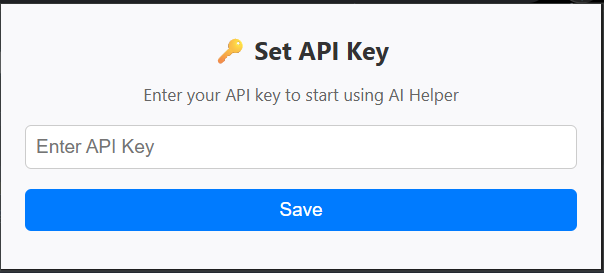
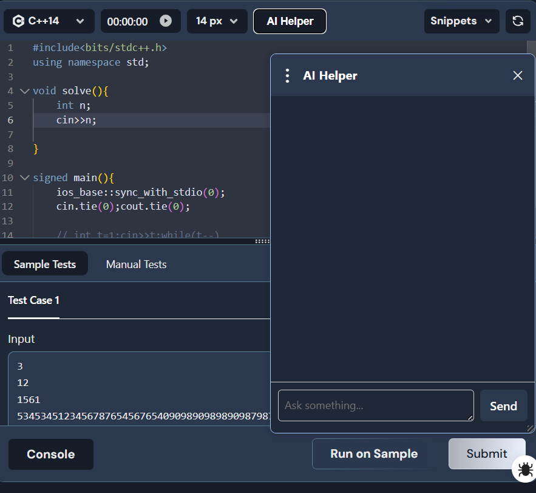
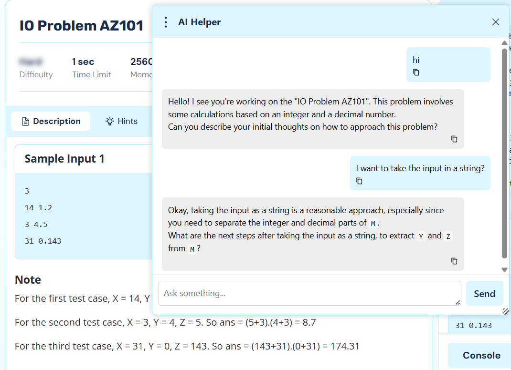

# 🧠 AI Helper – Chrome Extension

**AI Helper** is a lightweight and powerful Chrome extension that adds an AI-powered assistant to maang.in. It allows you to interact with an AI model (Gemini) directly within the webpage using a sleek, draggable and resizable chat interface. The chat history is maintained and the AI has complete context of the problem.

---

## 🚀 Features

- 💬 Interactive chat box
- 🧲 Draggable and resizable UI with smooth design
- 🌙 Light/Dark mode adaptive styling
- 🔑 API Key management via popup
- 💾 Chrome storage support (stores chat history and API key)
- 📜 Clean and modern UI built with HTML, CSS, and JavaScript

---

## 🧩 Major Problems resolved
- 🧭 Dealing with single-page applications (SPAs) that don't trigger full reloads, requiring detection via MutationObserver.
- 🔄 Intercepted XHR/fetch request, to access dynamically rendered data, and allowed the extension to access real-time API responses.

---

## 📷 Screenshots

- Enter Your Gemini API Key by clicking on the extension icon
> 

- Click "AI Helper" button.
> 

- Draggable and resizable Chatbox, integrates with the theme.
> 

- AI model is aware of the problem, ask and resolve doubts.
- Delete chat history by clicking on the three dot menu.

---

## 🛠️ Installation

1. **Clone the Repository**

```bash
git clone https://github.com/your-username/ai-helper-extension.git
cd ai-helper-extension
```

"Load Unpack" the folder ai-helper-extension in your chrome extensions.
